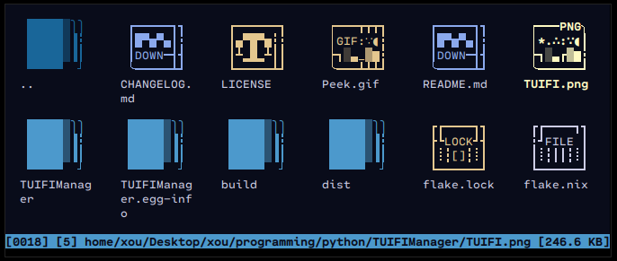
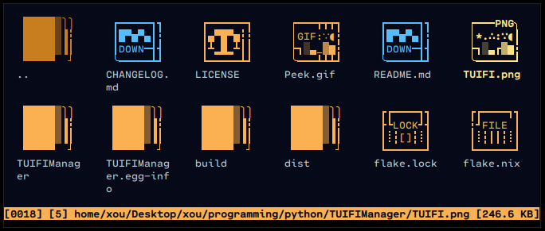
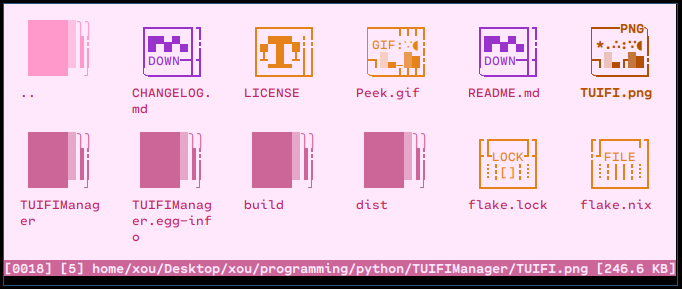

# 🗂️ Intro
The colorfull side of [TUIFIManager](https://github.com/GiorgosXou/TUIFIManager)! A place where you can find or contribute themes.
```terminal
git clone https://github.com/GiorgosXou/our-tuifi-themes ~/.config/tuifi/themes
```

# 🎨 Themes


<div align="center">
  <div>
    <code>tuifi_theme=azawy tuifi</code>
  </div>
  <div><b>Azawy</b> - inspired by the name of <a href="https://github.com/Naheel-Azawy" title="@Naheel">@Naheel</a></div>
  
  <div>
  </div>
    _
  <div>
    <code>tuifi_theme=ayu tuifi</code>
  </div>
  <div><b>Ayu</b> - a resemblance of ayu-mirage</div>
  
  <div>
    _
  </div>
  <div>
    <code>tuifi_theme=candycloudy tuifi </code>
  </div>
  <div><b>CandyCloudy</b> - a story about pink clouds told to me by a lady</div>
  
</div>


<br><sup>WORK IN PROGRESS 🏗️</sup>
